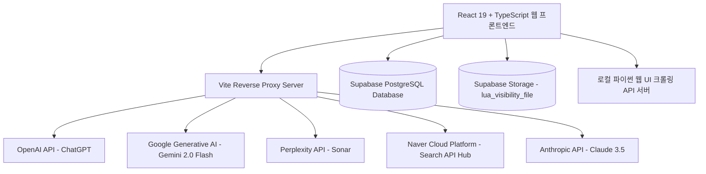

# 01. 시스템 아키텍처 및 전체 기능 개요 (System Architecture & Overview)

## 📌 시스템 목적
**루비스(LUVIS) AI 가시성 진단 시스템**은 생성형 AI 검색 엔진(ChatGPT, Google Gemini, Perplexity, Naver API Hub, Claude 등)에서 특정 의료기관(병원)이 잠재 환자의 질문에 얼마나 언급(Mentioned)되고 추천(Recommended)되는지를 실시간으로 측정, 분석, 검증하는 전문 가시성 분석 웹 애플리케이션입니다.

---

## 🏗️ 전체 시스템 아키텍처



---

## 🧭 상단 글로벌 내비게이션 바 (Global Navigation)

| 버튼명 | 테마 색상 | 주요 기능 |
|---|---|---|
| **병원정보 질문세트관리** | Slate / Orange | 병원 기본정보, 고유 별칭, 지역키워드, 경쟁병원, 질문 세트(Q01~Q10) CRUD |
| **AI가시성 진단 재실행** | Purple | 진단 회차별 실패 질문 개별/일괄 재실행, 스텝 3/4 재실행 및 Remake Report 생성 |
| **웹 UI 실측 및 교차비교** | Emerald | 실제 웹 브라우저 UI 크롤링 결과와 API 결과 교차 비교 및 차이사유 분석 |
| **스토리지 파일함** | Sky Blue | Supabase Storage (`Report`, `Remake_Report`, `Audit`) 파일 실시간 조회/다운로드 |
| **다중 회차 추이 분석** | Indigo | 여러 회차(Run ID)를 선택하여 4대 지표, AI 채널별 언급률, 질문별 매트릭스 추이 분석 |
| **설정 / 로그아웃** | Slate / Red | 관리자 비밀번호 변경 및 보안 세션 관리 |

---

## 📂 프론트엔드 디렉토리 구조

```
lua_visibility_Web/
├── .agents/                                # 프로젝트 규칙 및 GitHub 자동화 스킬
├── public/                                 # 파비콘 및 정적 에셋
├── src/
│   ├── components/
│   │   ├── common/
│   │   │   └── AdminSettingsModal.tsx      # 관리자 설정 모달
│   │   ├── dashboard/                      # 핵심 기능 대시보드 컴포넌트
│   │   │   ├── HospitalManagementModal.tsx # 병원 및 질문 세트 관리 모달
│   │   │   ├── IframeModal.tsx             # 내장 브라우저 뷰어 모달
│   │   │   ├── LeftPanel.tsx               # 진단 설정 및 실시간 진행 패널
│   │   │   ├── RerunModal.tsx              # 가시성 재실행 및 스텝 3,4 재분석 모달
│   │   │   ├── RightPanel.tsx              # 실시간 콘솔 터미널 패널
│   │   │   ├── RunSelector.tsx             # 진단 회차 선택 커스텀 컴포넌트
│   │   │   ├── StorageFileManagerModal.tsx # Supabase Storage 파일 보관함 모달
│   │   │   ├── TrendAnalysisModal.tsx      # 다중 회차 추이 분석 대시보드 모달
│   │   │   └── WebVerificationModal.tsx    # 웹 UI 실측 및 교차 비교 모달
│   │   └── layout/
│   │       └── Header.tsx                  # 상단 글로벌 내비게이션 헤더
│   ├── contexts/
│   │   ├── AuthContext.tsx                 # 관리자 인증 Context
│   │   └── DashboardContext.tsx            # 진단 실행 및 실시간 진행률 Context
│   ├── hooks/
│   │   └── useHospitals.ts                 # 병원 목록 및 설정 조회 훅
│   ├── lib/
│   │   ├── analyzer.ts                     # AI 답변 언급/추천/경쟁사 분석 엔진
│   │   ├── providers.ts                    # LLM 및 검색 API 호출 클라이언트
│   │   ├── reportGenerator.ts              # 영업용 리포트 생성 및 스토리지 업로더
│   │   └── supabase.ts                     # Supabase 클라이언트 인스턴스
│   ├── pages/
│   │   ├── Dashboard.tsx                   # 메인 대시보드 페이지
│   │   └── LoginPage.tsx                   # 관리자 로그인 페이지
│   ├── App.tsx                             # 라우터 및 글로벌 프로바이더
│   └── main.tsx                            # 엔트리 포인트
├── mdFile/                                 # 전체 기능별 세부 기술 문서
├── start_app.bat                           # 원클릭 자동 실행 배치파일
└── vite.config.ts                          # Vite 프록시 및 빌드 환경 설정
```
