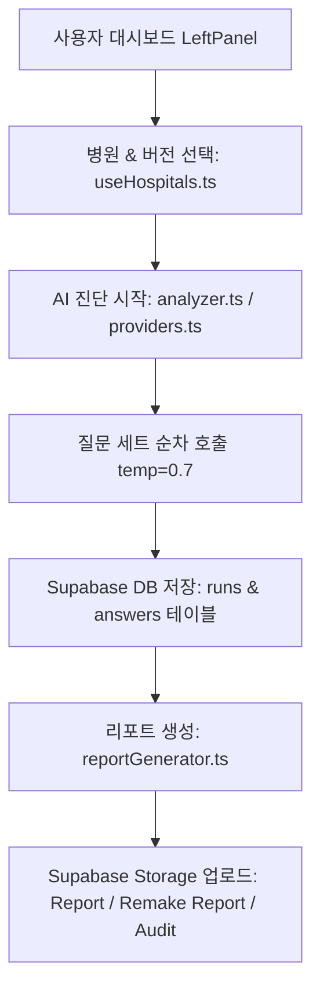

# LUA AI Visibility Web Engine 프로젝트 구조 및 소스 코드 분석 (Context.md)

---

## 1. 개요 (Overview)

**LUVIS (LUA AI Visibility Web Engine)** 은 대형 언어 모델(ChatGPT, Google Gemini, Perplexity 등) 기반 서비스에서 특정 병원이 주요 검색/질의에 얼마나 잘 언급되고 추천되는지를 측정·분석하고, 영업 및 분석용 진단 리포트(PDF/Markdown/HTML)를 생성 및 저장하는 **웹 기반 AI 가시성 진단 솔루션**입니다.

---

## 2. 전체 디렉토리 및 파일 구조

```
lua_visibility_Web/
├── .agents/                                # 프로젝트 규칙 및 깃허브 업로드 전용 스킬 정의
│   ├── AGENTS.md                           # 프로젝트 가이드라인 규칙
│   └── skills/github_upload/SKILL.md       # 자동 깃허브 업로드 스킬
│
├── public/                                 # 파비콘 및 정적 아이콘
├── src/
│   ├── components/
│   │   ├── dashboard/                      # 핵심 대시보드 컴포넌트 & 모달 5종
│   │   │   ├── HospitalManagementModal.tsx # 병원 관리 & 질문 세트 4종 텍스트/JSON 변환 모달
│   │   │   ├── IframeModal.tsx             # 내장 뷰어 실측 브라우저 모달
│   │   │   ├── LeftPanel.tsx               # 진단 설정, AI 도구 선택 및 실행 컨트롤 패널
│   │   │   ├── RerunModal.tsx              # 가시성 진단 재실행 & 스텝 3/4 DB UPDATE 모달
│   │   │   ├── RightPanel.tsx              # 실시간 콘솔 로그 & 진단 현황 뷰어
│   │   │   ├── RunSelectionModal.tsx       # 과거 측정 회차(Run ID) 선택 모달
│   │   │   └── WebVerificationModal.tsx    # 웹 UI 실측 & 교차 비교 분석 모달
│   │   ├── diagnostic/                     # 진단 진행 상황 컨트롤러
│   │   ├── reports/                        # 기회 영역 분석 시각화
│   │   └── results/                        # 교차 비교 결과 테이블
│   │
│   ├── contexts/
│   │   └── DashboardContext.tsx            # 전역 대시보드 상태 (진단 현황, 로그, 병원 코드 등)
│   │
│   ├── hooks/
│   │   └── useHospitals.ts                 # Supabase 병원 마스타 & 버전 정보 커스텀 훅
│   │
│   ├── lib/
│   │   ├── analyzer.ts                     # AI 가시성 측정, 성공률/언급률 분석 엔진
│   │   ├── providers.ts                    # OpenAI, Gemini, Perplexity API 클라이언트
│   │   ├── reportGenerator.ts              # HTML, MD, PDF 생성 및 Supabase Storage 업로더
│   │   └── supabase.ts                     # Supabase JS 클라이언트 설정
│   │
│   ├── pages/
│   │   └── Dashboard.tsx                   # 메인 대시보드 레이아웃 페이지
│   │
│   ├── App.tsx                             # 최상위 라우팅 및 Context 공급자
│   ├── index.css                           # 전역 Tailwind CSS 스타일 및 input/textarea 가독성 설정
│   └── main.tsx                            # React 진입점
│
├── supabase/
│   └── migrations/
│       └── schema.sql                      # Supabase DDL, RLS 보안 정책 및 Storage 권한 설정
│
└── mdFile/
    ├── Context.md                          # 프로젝트 맥락 및 기술 구조 명세서
    ├── README.md                           # 웹 프로젝트 사용 설명서
    ├── CHANGELOG.md                        # 일자별 마이그레이션 & 기능 변경 이력
    └── Mig_to_Web.md                       # 웹 마이그레이션 결과 명세서
```

---

## 3. 핵심 아키텍처 및 워크플로

### 3.1 AI 가시성 측정 & 리포트 저장 워크플로



1. **설정 로드**: `useHospitals.ts`에서 Supabase DB로부터 등록된 병원 및 active 버전을 로드.
2. **질문 세트 유연 파싱**: DB 저장 형태가 JSON 배열이든 줄바꿈 텍스트든 `parseQueries` 헬퍼로 유연하게 파싱.
3. **진단 수행 & AbortController 연동**: 비동기 루프로 질문을 수집하며 중단 요청 시 안전 종료.
4. **결과 저장**: `runs` 및 `answers` 테이블에 진단 결과 및 성공률/언급률 저장을 완료.
5. **Storage 분개 저장**:
   - `Report/`: 영업용 PDF 생성 시 저장.
   - `Remake Report/`: 진단 재실행 모달 리포트 생성 시 저장.
   - `Audit/`: 감사 데이터 JSON 저장.
   - 파일명: `001_청주필한방병원_진단.pdf`와 같이 실제 병원명 포함.
