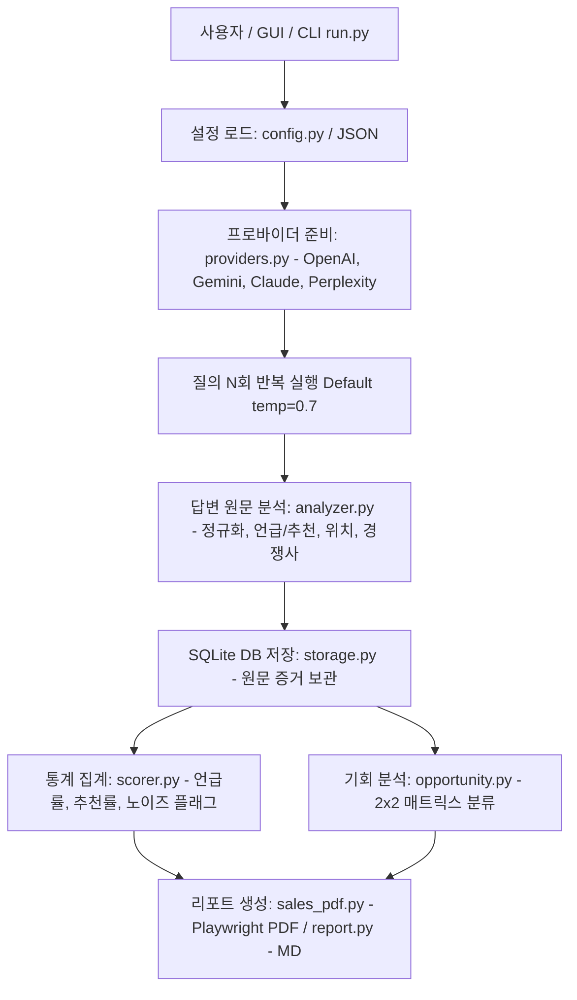

# LUA AI Visibility Engine 프로젝트 구조 및 소스 코드 분석 (Context.md)

---

## 1. 개요 (Overview)

**LUA AI Visibility Engine (루비스, LUVIS)** 은 루아컴퍼니(루아브랜딩연구소)에서 개발한 **병원 AI 가시성(Visibility) 측정 및 분석 솔루션**입니다. 
주요 목표는 ChatGPT, Google Gemini, Perplexity (Claude는 현재 비활성화) 등 대형 언어 모델(LLM) 기반 서비스에서 특정 병원이 주요 검색/질의에 얼마나 잘 언급되고 추천되는지를 측정·분석하고, 영업 및 분석용 진단 리포트(PDF/Markdown)를 생성하는 것입니다.

---

## 2. 전체 디렉토리 및 파일 구조

```
lua_visibility_engine/
├── .antigravityrules                        # 시스템/에이전트 규칙 설정 파일
├── keys.json                               # API 키 저장소 (Git 제외 대상, 런타임 저장)
├── lua_gui.pyw                             # tkinter 기반 GUI 실행기 (루트 배치)
├── lua_visibility.db                       # SQLite DB (원문 증거, 분석 결과 저장)
├── preflight_진단.bat                       # Gemini 1회 진단 런타임 검증 배치 스크립트
├── run_검색OFF.bat                         # 검색 그라운딩 비활성화 비교 테스트 배치 스크립트
│
├── Hospital_info/                          # 병원별 설정/데이터 원본 모음
│   ├── hospital.example.json               # 병원 프로필/질문/경쟁사 설정 예시
│   └── 청주필한방병원.json                   # 실제 진단 병원 프로필 예시 (trust_url 포함)
│
├── lua_visibility/                         # 코어 분석 엔진 패키지 (모든 엔진 소스 수록)
│   ├── __init__.py
│   ├── analyzer.py                         # 답변 1건 단위 정규화 매칭 및 휴리스틱 판정
│   ├── check_trust.py                      # Trust Signal 독자 실행 스크립트 모듈
│   ├── config.py                           # 병원 프로필, 측정 설정(온도, 반복 횟수 등) 정의
│   ├── opportunity.py                      # 2x2 기회지도 매트릭스 (선점기회/탈환대상/경합/독점우위)
│   ├── providers.py                        # LLM API 프로바이더 클라이언트 (OpenAI, Gemini, Perplexity, Mock (Claude 비활성화))
│   ├── regenerate.py                       # 재측정/부분 갱신 로직
│   ├── report.py                           # Markdown 리포트 생성기
│   ├── run.py                              # CLI 메인 실행기 (엔진 오케스트레이터 단일 진입점)
│   ├── run_reader.py                       # DB run 조회 유틸리티
│   ├── sales_pdf.py                        # Playwright 기반 HTML->PDF 영업진단서 렌더러
│   ├── scorer.py                           # N회 반복 측정 데이터 통계 집계 및 노이즈 플래그 생성
│   ├── storage.py                          # SQLite 데이터 저장 및 스키마 관리
│   ├── tasklog.py                          # 실행 작업 로그 및 스탯 조회 유틸리티
│   └── trust_signal.py                     # Trust Signal 진단 코어 모듈
│
├── mdFile/
│   ├── Context.md                          # 프로젝트 분석 및 맥락 정보 정리
│   ├── README.md                           # 프로젝트 설명서
│   ├── CHANGELOG.md                        # 일자별 패치/버그 수정 및 기능 변경 이력
│   ├── Mig_to_Web.md                       # React+Supabase+Cloudflare 웹 마이그레이션 종합 명세서
│   ├── LUVIS_개발_프롬프트_Claude_2026-07-29.md
│   └── LUVIS_개발_프롬프트_OpenAI_2026-07-29.md
│
├── tests/                                  # 테스트 코드
│   ├── test_baseline_mock.py               # Mock 기반 베이스라인 단위 테스트
│   ├── test_from_run.py                    # run 연동 통합 테스트
│   └── test_from_run_hardening.py          # 경계 조건 및 엣지 케이스 내구성 테스트
│
├── Audit/                                  # 감사 및 수행 이력 CSV 로그 저장소
└── Report/                                 # 생성된 리포트 파일 출력 디렉토리
```

---

## 3. 핵심 아키텍처 및 작업 흐름 (Data Flow)

### 3.1 AI 가시성 측정 워크플로 (Visibility Measurement Workflow)



1. **설정 로드 (`config.py`)**: `HospitalProfile`을 통해 대상 병원명, 별칭(aliases), 경쟁사 목록, 측정 질의 세트를 구성. (JSON 내 `trust_url` 자동 읽기 지원)
2. **N회 반복 호출 (`providers.py`)**: 재현성 확보를 위해 질의당 반복 호출 (`temperature=0.7`). API 키 유무에 따라 사용 가능한 모델 자동 선택.
3. **답변 단건 분석 (`analyzer.py`)**:
   - 정규화(`_norm`): 특수문자/공백/줄바꿈을 제거하여 표기 변형에 유연하게 대응.
   - 언급/추천/위치 판정: 별칭 매칭, 신호어 및 목록 형태 휴리스틱으로 추천 여부 판정, 첫 등장 위치 계산.
   - 경쟁사 추출: 경쟁사 사전 기준 포함 여부 체크.
4. **증거 보관 (`storage.py`)**: 모든 AI 답변 원문, 모델 버전, 생성 시각, 분석 결과를 SQLite DB(`lua_visibility.db`)에 영구 저장.
5. **통계 및 2x2 매트릭스 집계 (`scorer.py`, `opportunity.py`)**:
   - 노이즈(불안정 구간) 플래그 자동 부여 (예: 5회 중 2회만 언급된 질의).
   - 우리 병원 노출률 vs 경쟁사 노출률 비교를 통한 4대 기회 유형(선점기회/탈환대상/경합/독점우위) 자동 분류.
6. **영업용 리포트 출력 (`sales_pdf.py`, `report.py`)**: Playwright Chromium 렌더링 엔진을 활용해 영업용 진단 PDF 생성 (Playwright 미설치 시 HTML 백업 처리).

### 3.2 웹사이트 신뢰성 진단 (Trust Signal Score Workflow)

- **`lua_visibility/check_trust.py` & `lua_visibility/trust_signal.py`**:
  - 병원 자사 사이트가 LLM/검색 크롤러에게 올바르게 접근 가능하고 구조화되어 있는지 100점 만점으로 진단.
  - A. 크롤러 접근성(25점, robots.txt), B. 구조화 데이터(30점, JSON-LD / FAQPage / MedicalBusiness), C. 콘텐츠 자산(25점, Open Graph, H1/H2), D. 기술 가독성(20점, HTML 태그 구조).

---

## 4. 모듈별 세부 소스 분석

### 4.1 CLI 메인 및 오케스트레이터 ([run.py](file:///c:/1.RuaCompany/lua_visibility_engine/lua_visibility/run.py))
- **역할**: CLI 인자 처리, 전체 프로바이더/질문 실행 루프 제어, 중단 신호(`.cancel_request`) 감지, 전체 타임아웃 관리, DB 저장 및 리포트 빌드 총괄.

### 4.2 GUI 실행기 ([lua_gui.pyw](file:///c:/1.RuaCompany/lua_visibility_engine/lua_gui.pyw))
- **역할**: Python 표준 라이브러리 `tkinter` 기반 GUI UI.
- **특징**:
  - `keys.json`을 통한 API 키 관리 및 병원 JSON의 `trust_url` 자동 읽기 및 화면 반영.
  - 데모 모드 (외부 API 호출 없이 Mock 실행) 지원.
  - 서브프로세스로 `lua_visibility.run`을 비동기 호출하고 파이프 단계를 감지하여 진행 현황 UI 실시간 업데이트.

### 4.3 분석기 ([lua_visibility/analyzer.py](file:///c:/1.RuaCompany/lua_visibility_engine/lua_visibility/analyzer.py))
- **역할**: LLM 답변 1건에 대한 텍스트 처리 및 정규화.
- **주요 함수/클래스**:
  - `_norm(s)`: 한글/영문/숫자만 추출하여 정규화.
  - `HospitalMentionAnalyzer.analyze(text)`: 언급 여부, 매칭된 별칭, 첫 위치, 경쟁사 목록, 추천 여부(`RECOMMEND_CUES` 및 마크다운 목록 패턴) 추출.

### 4.4 프로바이더 ([lua_visibility/providers.py](file:///c:/1.RuaCompany/lua_visibility_engine/lua_visibility/providers.py))
- **역할**: 다양한 LLM API 호출 통합 인터페이스.
- **지원 모델**: OpenAI (ChatGPT-4o 등), Google Gemini (gemini-1.5-flash 등), Anthropic Claude (claude-3-5-sonnet 등), Perplexity, Mock (테스트용).

### 4.5 통계 및 기회 집계 ([scorer.py](file:///c:/1.RuaCompany/lua_visibility_engine/lua_visibility/scorer.py) & [opportunity.py](file:///c:/1.RuaCompany/lua_visibility_engine/lua_visibility/opportunity.py))
- **`scorer.py`**: N회 반복 결과로부터 노출 비율, 추천 비율, 평균 등장 위치, 노이즈 여부(`unstable`) 산출.
- **`opportunity.py`**: 자사 및 경쟁사 노출 비율을 기반으로 2x2 매트릭스를 구성하고, 각 질의별 영업적 가치(선점기회/탈환대상 등) 및 조치 가이드를 생성.

### 4.6 PDF 리포트 렌더러 ([sales_pdf.py](file:///c:/1.RuaCompany/lua_visibility_engine/lua_visibility/sales_pdf.py))
- **역할**: Playwright(Chromium)를 이용하여 HTML/CSS 기반의 영업용 진단 PDF 생성 (Playwright 미설치 환경을 위한 안전한 HTML Fallback 지원).
- **주요 구성**: 표지, AEO 노출 분석, 2x2 기회지도 매트릭스, GEO 준비도, Trust Signal 점수, 실행 우선순위 5가지, Next Step, 용어집.

---

## 5. 결론 및 개발 가이드

- **확장성**: 새로운 LLM 모델 추가 시 `lua_visibility/providers.py`에 프로바이더 클래스를 추가하고 `build_provider` 함수에 등록하면 쉽게 확장 가능.
- **안전성**: GUI 실행 중 중단 신호 파일(`.cancel_request`)을 이용해 진행 중인 비동기 작업을 안정적으로 취소하고 DB 상태를 보호하도록 설계됨.
- **독립성**: GUI는 별도 파이썬 외부 라이브러리(PyQt 등) 없이 표준 `tkinter`만 사용하여 배포 부담을 최소화함.
