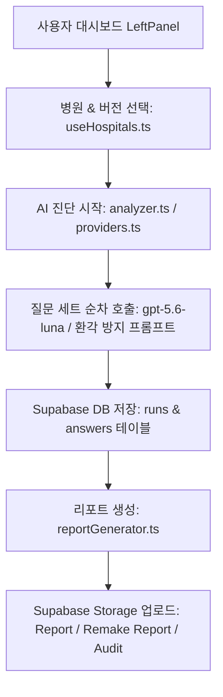

# LUA AI Visibility Web Engine 프로젝트 구조 및 소스 코드 분석 (Context.md)

---

## 1. 개요 (Overview)

**LUVIS (LUA AI Visibility Web Engine)** 은 대형 언어 모델(ChatGPT `gpt-5.6-luna`, Google Gemini `gemini-2.0-flash`, Perplexity `sonar-pro`, Claude `claude-3-5-sonnet`, Naver API Hub) 및 실물 브라우저 크롤러(Playwright 기반 `api_server.py`)를 통해 특정 병원이 주요 검색/질의에 얼마나 잘 언급되고 추천되는지를 측정·분석하고, 영업 및 분석용 진단 리포트(PDF/Markdown/HTML)를 생성 및 저장하는 **웹 기반 AI 가시성 진단 솔루션(v1.1.0)**입니다.

---

## 2. 전체 디렉토리 및 파일 구조

```
lua_visibility_Web/
├── .agents/                                # 프로젝트 규칙 및 깃허브 업로드 전용 스킬 정의
│   ├── AGENTS.md                           # 프로젝트 가이드라인 규칙
│   └── skills/github_upload/SKILL.md       # 자동 깃허브 업로드 스킬
│
├── public/                                 # 파비콘 및 브랜드 로고(logo.ico)
├── src/
│   ├── components/
│   │   ├── dashboard/                      # 핵심 대시보드 컴포넌트 & 모달 7종
│   │   │   ├── HospitalManagementModal.tsx # 병원 관리 & 질문 세트 4종 텍스트/JSON 변환 모달
│   │   │   ├── IframeModal.tsx             # 내장 뷰어 실측 브라우저 모달
│   │   │   ├── LeftPanel.tsx               # 진단 설정, AI 도구 선택 및 실행 컨트롤 패널
│   │   │   ├── RerunModal.tsx              # 가시성 진단 재실행 & 스텝 3/4 DB UPDATE 모달
│   │   │   ├── RightPanel.tsx              # 실시간 콘솔 로그 & 진단 현황 뷰어
│   │   │   ├── RunSelectionModal.tsx       # 과거 측정 회차(Run ID) 선택 모달
│   │   │   ├── StorageFileManagerModal.tsx # Supabase Storage 파일 보관함 모달
│   │   │   ├── TrendAnalysisModal.tsx      # 다중 회차 가시성 추이 분석 대시보드 모달
│   │   │   └── WebVerificationModal.tsx    # 웹 UI 실측 & 교차 비교 분석 모달 (1:1 순차 실행 및 봇 우회 사전 로그인 탑재)
│   │   └── layout/
│   │       └── Header.tsx                  # 브랜드 로고 및 상단 글로벌 내비게이션 바
│   │
│   ├── contexts/
│   │   ├── AuthContext.tsx                 # 관리자 인증 Context
│   │   └── DashboardContext.tsx            # 전역 대시보드 상태 (진단 현황, 로그, 병원 코드 등)
│   │
│   ├── hooks/
│   │   └── useHospitals.ts                 # Supabase 병원 마스타 & 버전 정보 커스텀 훅
│   │
│   ├── lib/
│   │   ├── analyzer.ts                     # AI 가시성 측정, 성공률/언급률 분석 엔진
│   │   ├── providers.ts                    # OpenAI (gpt-5.6-luna), Gemini, Perplexity, Naver, Claude API 클라이언트
│   │   ├── reportGenerator.ts              # 9~10페이지 종합 진단 리포트 (Naver Dual 1:1 회차 매핑 포함) 생성기
│   │   ├── trustSignal.ts                  # 신뢰 콘텐츠 4대 자산 크롤링 및 안티봇 Double-Fetch 엔진
│   │   └── supabase.ts                     # Supabase JS 클라이언트 설정
│   │
│   ├── services/
│   │   └── api_server.py                   # Python Playwright 백엔드 크롤링 서버 (Port 5000, 봇 우회 & 세션 보존)
│   │
│   ├── pages/
│   │   ├── Dashboard.tsx                   # 메인 대시보드 레이아웃 페이지
│   │   └── LoginPage.tsx                   # 브랜드 로고 탑재 관리자 로그인 페이지
│   │
│   ├── App.tsx                             # 최상위 라우팅 및 Context 공급자
│   ├── index.css                           # 전역 Tailwind CSS 스타일 및 가독성 설정
│   ├── main.tsx                            # React 진입점
│   ├── start_app.bat                       # 파이썬 크롤러 + Vite + 앱 단독창 원클릭 실행기
│   └── vite.config.ts                      # 역방향 프록시 및 로컬 백엔드 크롤링 미들웨어(/api-proxy)
│
├── supabase/
│   └── migrations/
│       └── schema.sql                      # Supabase DDL, RLS 보안 정책 및 Storage 권한 설정
│
└── mdFile/
    ├── Context.md                          # 프로젝트 맥락 및 기술 구조 명세서 (현행화 완료)
    ├── README.md                           # 웹 프로젝트 사용 설명서
    ├── CHANGELOG.md                        # 일자별 마이그레이션 & 기능 변경 이력
    ├── 01_System_Architecture_and_Overview.md # 시스템 아키텍처 개요
    ├── 02_AI_Diagnosis_and_Providers.md    # AI 프로바이더 및 프록시 명세
    ├── 03_Naver_Local_Search_Hub.md        # 네이버 지역검색 허브 명세
    ├── 04_Web_Verification_and_Comparison.md # 웹 UI 실측 및 교차비교 (Playwright 봇 우회)
    ├── 05_Report_and_Storage_Management.md # 리포트 생성 및 스토리지 명세
    ├── 06_Multi_Run_Trend_Analysis_Dashboard.md # 추이 분석 대시보드
    ├── 07_Database_Schema_and_Security.md  # DB 스키마 및 RLS
    ├── 08_Naver_Dual_Visibility_설계서.md  # 네이버 로컬 가시성 설계서
    └── GEO Trust 점수기준.md               # GEO Trust 100점 만점 평가 기준서
```

---

## 3. 핵심 아키텍처 및 워크플로

### 3.1 AI 가시성 측정 & 리포트 저장 워크플로



1. **설정 로드**: `useHospitals.ts`에서 Supabase DB로부터 등록된 병원 및 active 버전을 로드.
2. **질문 세트 유연 파싱**: DB 저장 형태가 JSON 배열이든 줄바꿈 텍스트든 `parseQueries` 헬퍼로 유연하게 파싱.
3. **OpenAI 최신 추론 모델 탑재**: `gpt-5.6-luna` 모델 적용 및 엄격한 환각 억제 프롬프트(가짜 병원 생성 절대 금지, '병원' 질문 시에도 '신윤수내과의원' 등 1차/2차 의원급 의료기관 동등 추천) 탑재.
4. **실물 브라우저 크롤러 및 Cloudflare 봇 우회 (`api_server.py`)**:
   - 실물 Chrome 브라우저(`channel="chrome"`) + WebGPU 가속 플래그 탑재로 Cloudflare Turnstile 100% 정상 통과.
   - 봇 차단 시 구글 계정 OAuth 연동 사전 로그인(`mode=google`) 지원.
   - `WebVerificationModal.tsx`에서 1:1 순차 동기화(`await`)로 프로필 락 및 멀티탭 충돌 원천 차단.
5. **네이버 로컬 가시성(Naver Dual) 리포트 1:1 정합성 보장 (`reportGenerator.ts`)**:
   - `run.version`을 기준으로 정확한 설정 버전을 매핑.
   - **좌측 (A. 플레이스 점유율)**: 항상 네이버 전용 단축 검색어(`naver_queries[idx]`) 출력.
   - **우측 (B. 콘텐츠 바이럴 점유율)**: 항상 AI 공통 질문 전체 문장(`queries[idx]`) 출력.
6. **안티봇 우회 크롤링**: Cafe24 등 국내 호스팅사의 안티봇 보안을 돌파하기 위해 `trustSignal.ts` 내 **Double-Fetch (세션 쿠키 탈취 후 2차 재요청)** 및 Vite 로컬 백엔드 프록시(`/api-proxy`) 탑재.
7. **Storage 분개 저장**:
   - `Report/`: 영업용 PDF 생성 시 저장 (`001_청주필한방병원_20260821_01.html / .pdf`).
   - `Remake_Report/`: 진단 재실행 모달 리포트 생성 시 저장.
   - `Audit/`: 감사 데이터 JSON 저장.
