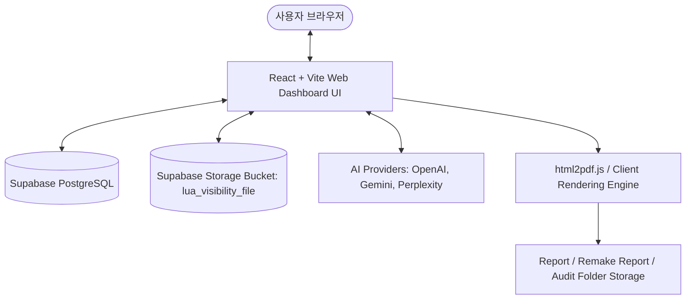

# 🚀 LUA AI 가시성 진단기 (LUVIS) 웹 마이그레이션 결과 명세서 (Mig_to_Web.md)

> 본 문서는 기존 Python (Tkinter GUI + SQLite + Playwright) 기반 **LUVIS AI 가시성 진단기**를 **React + TypeScript + Supabase + Cloudflare** 사양의 웹 애플리케이션으로 100% 마이그레이션 완료한 개발 명세서입니다.

---

## 📐 1. 완료된 웹 아키텍처

* **Frontend**: React 18, Vite, TypeScript, Tailwind CSS, Lucide Icons
* **Database**: Supabase PostgreSQL (RLS 보안 정책 연동)
* **Storage**: Supabase Storage (`lua_visibility_file` 버킷내 `Report/`, `Remake Report/`, `Audit/` 관리)
* **PDF Engine**: Client-side html2pdf.js / jsPDF 엔진

---

## 🗂️ 2. 소스 파일 대조 및 완료 매핑표

| 기존 Python 소스 | 역할 | 마이그레이션 완료 컴포넌트 / 모듈 | 상태 |
| :--- | :--- | :--- | :---: |
| `lua_gui.pyw` | 전체 Tkinter GUI 화면 | `src/pages/Dashboard.tsx`, `LeftPanel.tsx`, `RightPanel.tsx` | ✅ 완료 |
| `storage.py` | SQLite DB CRUD & 스키마 | `src/lib/supabase.ts`, `supabase/migrations/schema.sql` | ✅ 완료 |
| `providers.py` | AI API 프로바이더 호출 | `src/lib/providers.ts`, `src/services/ai/providers.ts` | ✅ 완료 |
| `run.py` | 진단 실행 오케스트레이터 | `src/lib/analyzer.ts`, `LeftPanel.tsx` | ✅ 완료 |
| `sales_pdf.py` | HTML -> PDF 렌더링 | `src/lib/reportGenerator.ts` (html2pdf.js 연동) | ✅ 완료 |
| `web_verifier.py` | 웹 UI 실측 & 교차 비교 | `src/components/dashboard/WebVerificationModal.tsx` | ✅ 완료 |
| `analyzer.py` / `scorer.py` | 노출/추천/신뢰도 계산 | `src/lib/analyzer.ts` | ✅ 완료 |
| `hospital_manager.py` | 병원 & 질문 세트 CRUD | `src/components/dashboard/HospitalManagementModal.tsx` | ✅ 완료 |

---

## 📋 3. 마이그레이션 완료 내역 (Phases)

### Phase 1: DB 스키마 & Supabase Storage RLS 완료 (`schema.sql`)
- `hospitals`, `hospital_config_versions`, `runs`, `answers`, `web_verifications`, `web_verification_answers` 테이블 및 RLS 보안 정책 구축.
- `storage.objects` 스토리지 RLS 정책 적용으로 `lua_visibility_file` 버킷 익명 생성/수정/조회 허용.

### Phase 2: AI 엔진 및 API 클라이언트 이관
- OpenAI (`gpt-4o`), Google Gemini (`gemini-1.5-pro`), Perplexity API 호출 구현.
- `AbortController` 기반 진단 비동기 안전 중단 연동.

### Phase 3: 대시보드 웹 UI & 팝업 모달 4종 정밀 이관
1. **병원 정보 & 질문 세트 관리 (`HospitalManagementModal.tsx`)**: 4종 데이터(별칭, 지역키워드, 경쟁병원, 질문문구) 줄바꿈(`\n`) UI ↔ JSON 배열 DB 저장 직렬화 양방향 변환.
2. **가시성 진단 재실행 (`RerunModal.tsx`)**: 해당 회차 체크박스 동적 선택, 실패 질문 개별/일괄 재실행, 스텝 3/4 DB UPDATE 저장 및 `Remake Report/` PDF 저장.
3. **웹 UI 실측 및 교차 비교 (`WebVerificationModal.tsx`)**: 플랫폼별 노출 비교, 내장 뷰어 연동, 파이썬 소스 이식 차이사유/메모 자동 생성기, 전체 질문 순차 자동 실측.
4. **측정 회차 선택 (`RunSelectionModal.tsx`)**: past Run 목록 팝업 및 특정 Run 재선택 흐름 구축.

### Phase 4: PDF 리포트 & Storage 경로 분개 완료
- **`Report/`**: 대시보드 메인 `[영업용 PDF 생성]` 저장.
- **`Remake Report/`**: 가시성 진단 재실행 모달 `[📄 진단 PDF 생성]` 저장.
- **`Audit/`**: 감사/로그 데이터 JSON 저장.
- 파일명 내 실제 병원명 반영 (`001_청주필한방병원_진단.pdf`).
